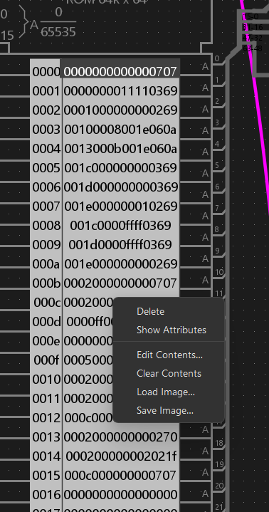
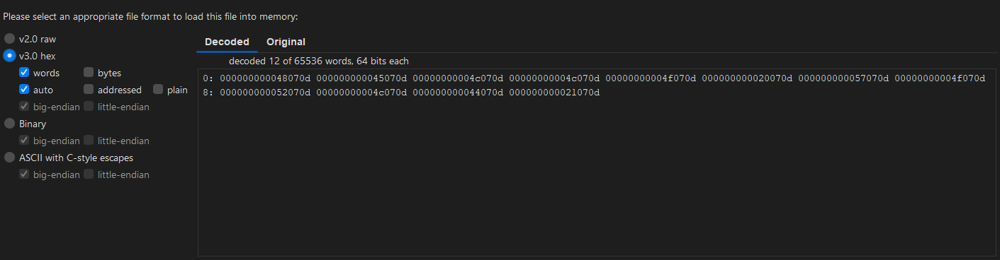

# Intro
i made a console in logisim evolution. it's an extremely simple console that doesn't even have microcode, but i'm still quite pleased with it. i don't have many demos for it, i hope to change that sometime. but if you want to make something for it, here's the guide:
# Simple16 manual
Simple16, as the name implies, is a very simple console. and the assembler is quite simple as well-just a little python code. but it may be a bit difficult to use without guidance, especially if you're a seasoned assembly programmer confused by why _#include common_ errors out. so i made a guide.
## Opcodes
a computer wouldn't do anything without opcodes. and an assembler is useless without the ability to turn inert text into inert code. so here's the framework for the inert text:

### ALU Vs. BLU Operations
while you write it all the same, there are two distinct types of opcodes: **ALU** operations, and **BLU** operations.
**ALU** operations use the ALU (suprise), and they tell a register that it's not good enough and needs to change. that change is determined by the ALU.  now **BLU** operations determine if the _program counter_ needs to change. if the program counter does need to change, it will be changed to whatever the third parameter is. (always interpreted as a constant)
for ALU operations, the third parameter is what register changes, and in _SimpleASM_, that's a single number, so writing writing 1 to R0 would look like this:
```asm
MOV C1 0
```
or this:
```asm
MOV C1 R0
```
it doesn't matter if you prefix it with R or not-the assembler supports both cases. if you're wondering what the deal is with the C's, it's a required prefix for the parameters. in this case, it's a _decimal constant_, meaning that the input for that will always be the number _1_. more on that later.

for a BLU operation, the third parameter is a _label_, as BLU operations can cause branching, and it's easier to say which label to go to rather than which address (another assembly, _SYNASM_, is a simple and easy assembly language similar to this one, made for an old computer made in _the powder toy_, but it's biggest downfall is a lack of labels-to jump, you need a specific address. i did not want that for my assembly) to specify a label, you use the keyword _label_, it supports any casing, so _label_, _LABEL_, _Label_ and even _LaBeL_ work fine.
as for the name of the label, it's quite lenient, anything will work as long as there are no spaces (the way the assembler splits lines makes anything after a space fly under the radar here)
an example of a label:
```asm
Label start
MOV R1 R0 ;nonsensical code
NOT R1 R1
XOR R1 R0 R2
AND R1 R2 R2
NAND R0 R2 R0
JMP start
```
note that comments after lines do not require a semicolon; you can put whatever you want after a line and it will compile fine. for lines that are just a single comment though, you do indeed need a semicolon. any lines that start with a semicolon or are just blank are simply ignored by the assembler. so this is valid:
```asm
MOV R0 R1 comment
```
but it looks nicer and less confusing with a semicolon.
some BLU operations never jump; instructions such as ***NOP*** and ***RAMWRITE*** never branch; thus, the assembler does not require you to specify a label for such operations. in fact, specifying a label for these operations do absolutely nothing; the destination parameter will always get assembled to _0_ for these kinds of ops.
### parameter prefixes
there are a number of ways to tell what the operations input is. in hardware, for each parameter, there are only two types: register, and constant. but simpleASM has a multitude of other ways to say what gets fed into a function.

here is a list for parameter prefixes:
* **R** - the operand is supplied by a register
* **C** - the operand is a constant in signed decimal
* **U** - the operand is a constant in unsigned decimal
* **F** - the operand is a constant in decimal-this one supplies floating point instead of an integer
* **H** - the operand is a constant in hexadecimal
* **A** - the operand is a constant in ASCII; it takes one character after the prefix. note: does not support spaces
* **L** - pulls constant from a _C-Label_. more on that later

these prefixes for parameter 1 and 2 apply to both ALU and BLU operations.
### C-labels
just a few lines ago, i mentioned _C-labels_. here's the guide to them:

c-labels are a way to define constants in code. this console doesn't really support any kind of retreiving values directly from ROM, so there is no kind of encoding metadata. there is a way to define constants in _SimpleASM_ though. those constants are _c-labels_. to define a c-label, you do this:
```asm
CLABEL R0 XReg
```
### basic operations
with the basics covered, here are some essential operations:
|operation|description|
|-|-|
|**SCI**|scan increment. it's a fast way to scan through the screen as the way i've set up the screen makes it quite ineffeicent to simply use _add_.|
|**ADD**|adds two numbers.|
|**SUB**|subtracts two numbers.|
|**MUL**|multiplies two numbers|
|**DIV**|divides two numbers|
|**FADD**|floating point add. adds two floating point numbers.|
|**FSUB**|floating point subtraction. subtracts two floating point numbers.|
|**FMUL**|floating point multiplication. multiplies two floating point numbers.|
|**FDIV**|floating point division. divides two floating point numbers.|
|**MOV**|you've seen it quite a bit in this quide, it simply moves a number to a register|
|**AND**|bitwise AND|
|**NAND**|bitwise NAND|
|**OR**|bitwise OR|
|**NOR**|bitwise NOR|
|**XOR**|bitwise XOR|
|**XNOR**|bitwise XNOR|
|**BIC**|bit clear, clears bits (IE. _BIC HFFFF HFF00 = H00FF_) usefull if you need to store multiple values in one word.|
|**JMP**|uncoditionally jumps to the specified label|
|**BIE**|branch if equal. jumps to the specified label.|
|**BIBS**|funny name, stands for _branch if bit set_, essential for checking if a controller button is pressed|
|**BIBNS**|same as _BIBS_ but if the bit is _NOT_ set.|
|**ITF**|converts an integer to a float.|
|**FTI**|converts a float to an integer.|
|**RAMWRITE**|a BLU operation that never jumps. first parameter is address, second parameter is data|
|**RAMREAD**|an ALU operation which returns the contents of the address where the one and only parameter points to|

there are many other opcodes-in fact, this console has 145 operations total!
## unsuported stuff
if you want to get _#include common_ working, just don't. this assembler does not support libraries, _period_. the way this assembler was built would make it a challenge to implement libraries.
# importing guide
how nice, we just learned how to take jumbles of inert thought and turn them into jumbles of inert numbers, but how do we make it do the thing?
(keep in mind, for the screenshots, i have different window settings than the default. the menus may not look as good or as dark as this)
step 1: go to the ROM and right click. click on "load image" and select your file that you want to import.



step 2: you'll be met with this screen:


now set it to decode using "_v3.0 hex_" your screen shall now look like this:



# building the assembler
first, make sure pyinstaller and numpy is installed (this uses numpy to ensure constants are 16-bit, and to convert float to hex)
```bash
pip install pyinstaller
pip install numpy
```
then run
```bash
cd path/to/assembler
pyinstaller finalCompile.py --onefile
```

that's literally all there is to building this into an exe. you could also run finalCompile.py directly, providing you have numpy installed


